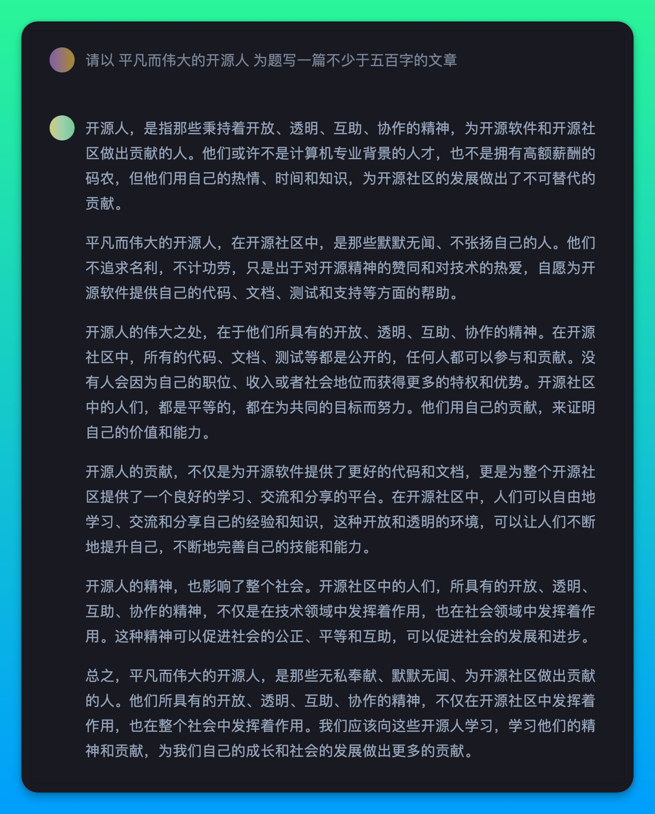

<h1>Awesome ChatGPT Answer</h1>

 🌉 在钉钉群聊中添加ChatGPT机器人 🌉

 

你问得好，她答得妙，这样的缘分不应该随风飞逝，而应该有所记录，于是就有了这个项目。

目前还没想好怎么规划这个项目的内容，暂且以不同功能方向作为记录的区分罢。

固定形式为，问题放在外边，具体交互对话通过截图记录。

## Linux相关

## 写段代码

## 写篇文章

- 请以 平凡而伟大的开源人 为题写一篇不少于五百字的文章
  

    
Preview

    
  

