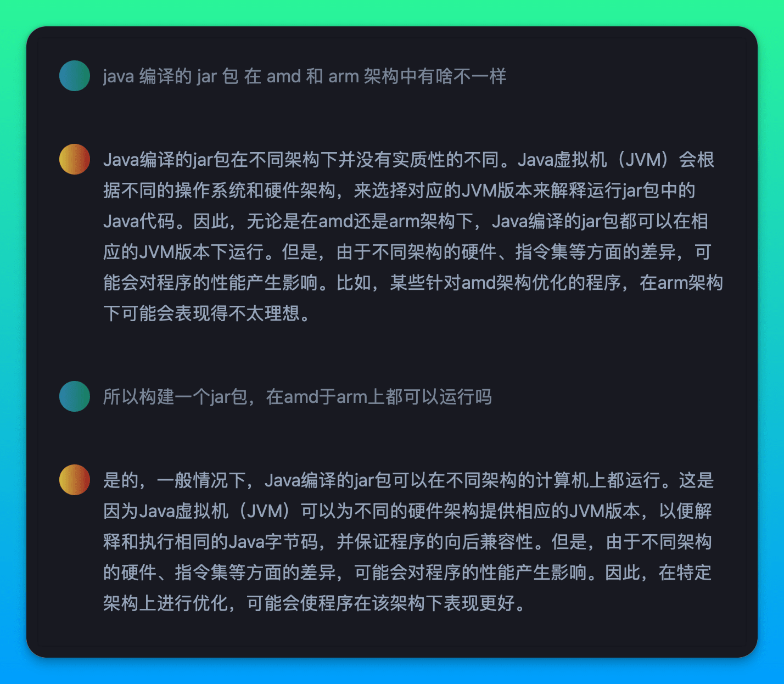
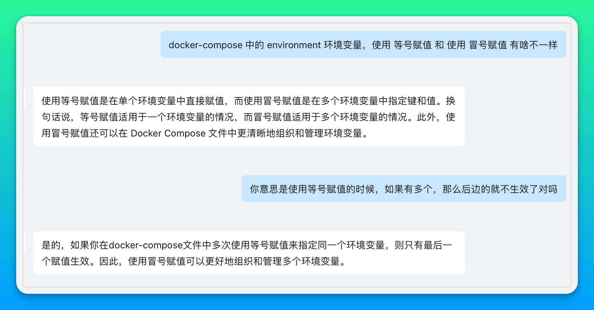
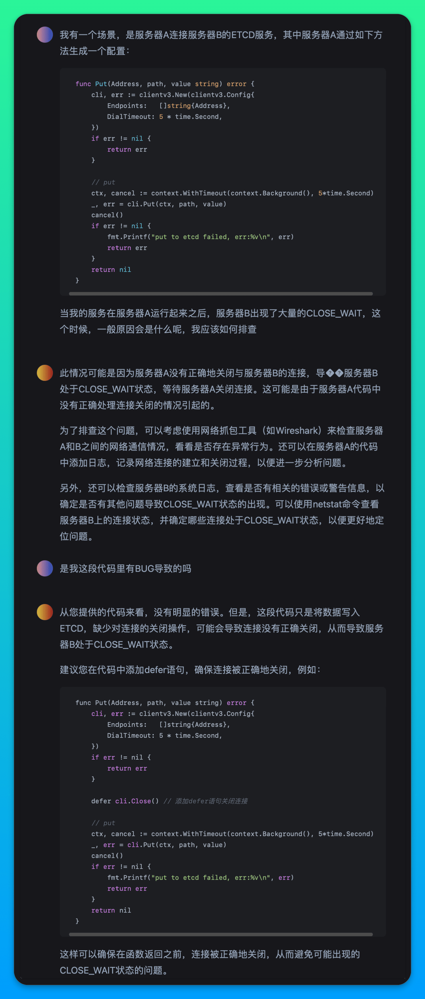
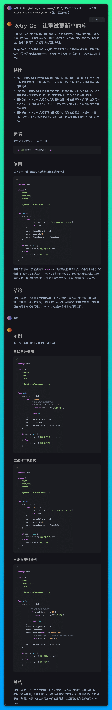

<h1>Awesome ChatGPT Answer</h1>

 🌉 在钉钉群聊中添加ChatGPT机器人 🌉

 

你问得好，她答得妙，这样的缘分不应该随风飞逝，而应该有所记录，于是就有了这个项目。

目前还没想好怎么规划这个项目的内容，暂且以不同功能方向作为记录的区分罢。

固定形式为，问题放在外边，具体交互对话通过截图记录。欢迎提交你与ChatGPT交互过程中遇到的那些精妙对话，格式与示例内容保持一致即可，注意图片上传之前请先压缩！

## Linux相关

- java 编译的 jar 包 在 amd 和 arm 架构中有啥不一样
  

    
Preview

    
  

- ~~docker-compose中的environment环境变量，使用等号赋值和使用冒号赋值有啥不一样~~
  

    
Preview

    
  

  这是个反向例子，你可以看到ChatGPT一本正经地讲了一个论点，但实际情况完全不是这样，实际情况是，如果使用等号模式，而赋值的时候，给值加了双引号或者单引号，那么docker-compose解析的时候，会把引号解析为值的一部分，因此建议任何时候都直接使用冒号模式，而不用等号模式。
- 关于服务器出现大量CLOSE_WAIT与代码之间的关系
  

    
Preview

    
  

## 前端相关

- yarn.lock 文件是如何生成的
  

    
Preview

    
  

## GitHub相关

- github 如何关闭fork仓库的自动同步
  

    
Preview

    
  

## 写段代码

## 写篇文章

- 请以 平凡而伟大的开源人 为题写一篇不少于五百字的文章
  

    
Preview

    
  

- 请参照 https://wiki.eryajf.net/pages/2bf6c3/ 这篇文章的风格，写一篇介绍 https://github.com/avast/retry-go 这个项目的文章
  

    
Preview

    
  

